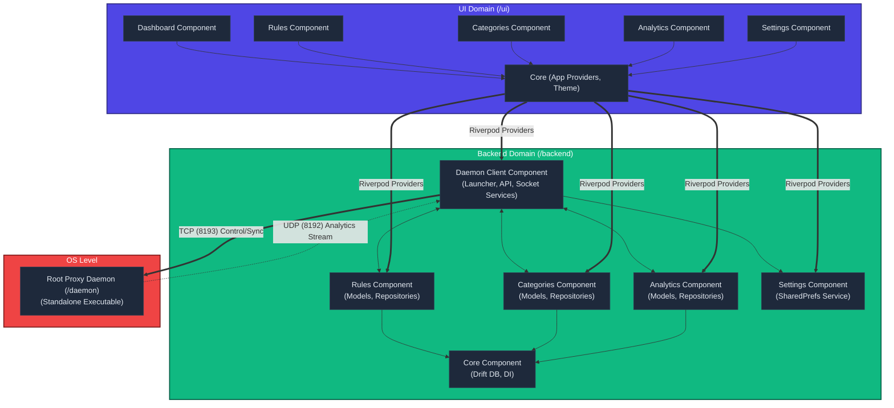

# Component-Based Architecture Diagram

Below is the high-level architecture diagram detailing the three main domains of the Restructed application (`/ui`, `/backend`, and `/daemon`) and how their internal components interact following our recent massive refactoring.

## How It Works

1. **Strict Layer Separation**: 
   The `UI` components never directly instantiate backend logic. They interact purely through the `Core` providers. This means your UI just "reacts" to state changes.

2. **Component Encapsulation**: 
   Inside the `/backend`, each feature (Rules, Categories, Analytics, Settings) is entirely self-contained. They possess their own Models, Repositories, and implementation logic. They only rely on the Backend `Core` component for shared database injection.

3. **The Event Hub (Daemon Client)**:
   The `Daemon Client` component is the beating heart of the system. It connects the Flutter frontend to the root executable.
   - It sends the user's latest blocklist to the Daemon via a **stateless TCP connection** on port `8193`.
   - It listens for incoming HTTP intercept attempts via a **stateless UDP broadcast** on port `8192`.
   - When a UDP hit is detected, the `Daemon Client` logs it using the `Analytics Component` and updates the UI in real-time.

4. **The Stateless OS Daemon**:
   The `/daemon` is a completely isolated executable running with root privileges. It holds absolutely no state or database of its own—it relies entirely on the `Daemon Client` to feed it the blocklist and takes action purely based on what it is told.
